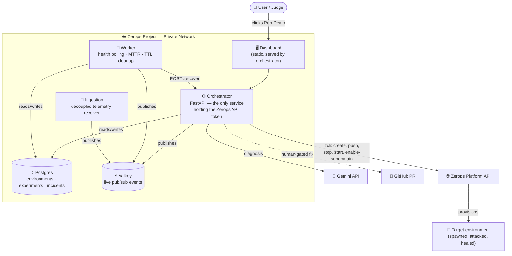

# 🛡️ Zerops Sentinel

**Break it on purpose. Watch it heal.**

Sentinel spawns a real, isolated environment from a GitHub repo on Zerops, deliberately kills it, measures how fast it recovers, diagnoses *why* it failed using an LLM cross-referenced against historical incidents, and stages a verified fix as a human-gated pull request — mirroring the same dev → stage → prod discipline Zerops itself is built around.

Most projects deploy *to* Zerops. Sentinel uses the Zerops API *as the product* — it's the mechanism, not the hosting layer underneath one.

---

## What it actually does

1. **Spawn** — paste a repo URL, Sentinel clones it, provisions a real Zerops project + service, pushes the code, and enables public access. No mock data, no simulated infrastructure.
2. **Chaos** — kill the running service on demand. A background worker polls its health in real time and measures recovery down to the second.
3. **Diagnose** — an LLM reads the service's actual logs, cross-references them against a lightweight local history of past incidents, and returns a root cause and a proposed fix.
4. **Heal** — the fix gets staged, verified, and opened as a pull request. A human still merges it. Nothing auto-deploys to production unreviewed.

A "For judges" panel runs this whole loop with one click, against a pinned demo repo — no setup, no typing required.

---

## Architecture

**One loop, five services:**

| Service | Role |
|---|---|
| `orchestrator` | FastAPI — every HTTP route, serves the static dashboard, the only service holding the Zerops API token |
| `worker` | Independent poll loop — health checks, MTTR computation, TTL-based project cleanup |
| `ingestion` | Decoupled telemetry receiver, keeps event volume off the orchestrator's request path |
| `db-postgres` (managed) | System of record — environments, experiments, incidents |
| `valkey-cache` (managed) | Transient — live status events for the dashboard's real-time UI |

---

## How Zerops is actually used

This isn't "deployed on Zerops" in the shallow sense — the Zerops API is the mechanism the product runs on:

- **`zcli project create` / `service-import`** — every "environment" a user spawns is a real, separate Zerops project, provisioned live via the CLI, not simulated
- **`zcli service stop` / `start`** — the chaos experiment *is* a real infrastructure action against a real running container
- **`zcli service enable-subdomain`** — the recovered service gets a genuine public URL, checked by the worker's health loop
- **Managed Postgres + Valkey** — the private network backing the whole system's state and live events
- **`zcli project delete`** — TTL-based teardown keeps spawned environments from piling up
- **Secrets via the Zerops GUI**, not hand-rolled — API tokens and keys never touch the repo

---

## Tech stack

`Python 3.11` · `FastAPI` · `Postgres` · `Valkey` · `Vanilla JS + Canvas` (no frontend framework) · `Gemini API` for diagnosis · `zcli` for every Zerops interaction

---

## AI tool usage — full disclosure

Built with AI assistance throughout, disclosed here per the rules of the event this was built for rather than as an afterthought:

**Claude** was used for architecture design, writing and iterating on the application code, and — critically — a large share of the actual *debugging* work described below. That debugging wasn't guesswork: several real, confirmed platform quirks were discovered and fixed this way, including:
- Zerops requiring `--org-id` on project creation for multi-org accounts
- `zcli` rejecting custom environment variables with a `ZEROPS_` prefix outright
- Secrets belonging exclusively to the Zerops GUI, never to `zerops.yaml`
- `zcli service create` having no `--type` flag — service type instead comes from a YAML doc, which led to adopting `zcli project service-import` after real deploy logs showed it working
- A synchronous spawn endpoint causing a genuine `504 Gateway Timeout`, fixed by moving the slow clone → push → enable-subdomain chain into a background task

**Antigravity**, Zerops's own ZCP coding agent, was used for the actual deployment loop — reading build/start failures from real logs and iterating until services came up healthy.

The full, unfiltered debugging history — including dead ends, wrong flag names that shipped and had to be caught later, and exact error messages — is preserved in [`TROUBLESHOOTING.md`](./TROUBLESHOOTING.md) rather than cleaned up for appearances. A from-scratch, step-by-step build walkthrough is in [`BUILD_GUIDE.md`](./BUILD_GUIDE.md).

---

## Known limitations, stated plainly

- **Arbitrary repo spawn is best-effort.** The pinned demo repo is guaranteed to work; a repo submitted by someone else only works if its `zerops.yaml` declares `setup: app`, since `service_name` is currently hardcoded.
- **The stage → PR fix loop is not yet fully wired.** `stage_verified` reports `true` without a real git checkout/diff/verify sequence behind it yet — don't mistake the plumbing for the guarantee.
- **This is a hackathon build, not a hardened product.** Rate limiting, multi-tenant auth, and cost caps on spawned environments are deliberately out of scope for now.

---

## Getting started

See [`BUILD_GUIDE.md`](./BUILD_GUIDE.md) for a complete, step-by-step walkthrough — every file, in the order it should be built, with the reasoning behind each piece.
